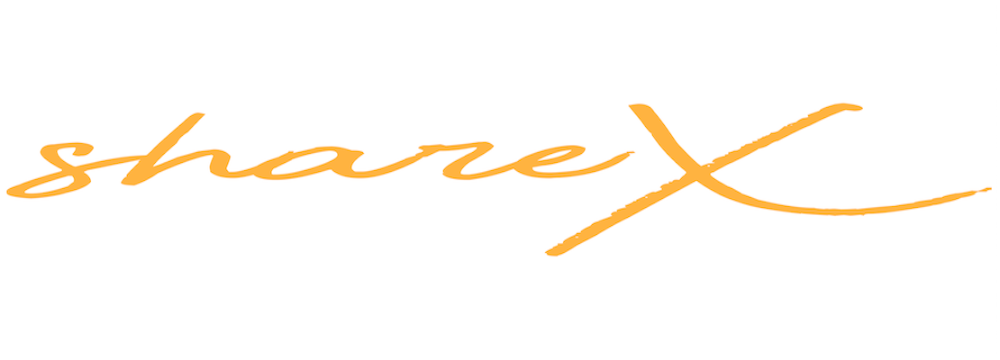
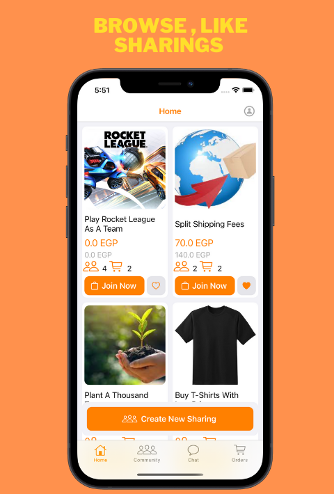

    

# ShareX - gather a team

**shareX - gather a team** gather a team for Any THING

Sharex let you gather a team to buy a very expensive product with slightly price when buying in groups .

Sharex let you gather a team to split bills when buying in groups.

Sharex let you gather a team to split shipping fees.

Shares let you gather a team for a charity.

Sharex let you gather a team for your soccer game .

Sharex let you gather a team for your e-sports game.

Sharex let you gather a team for anything . .

## ScreenShots

### ShareX

<<<<<<< HEAD
=======
![ShareX]https://apps.apple.com/us/app/sharex-gather-a-team/id1580312063)

>>>>>>> 33c2349536a110763733510765c7fa1254596d26

    
    
    
    

## Downlad

    <h1>Available on app store</h1>
    

## Feedback

Pull requests, issues and suggestions are warmly welcome.

Feel free to contact me [@amrmoussa777](https://amrmoussa777.github.io/).

